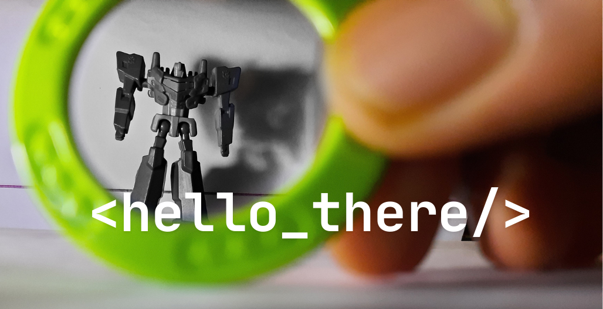

<h1 align="center">¡Hola! 👋, I'm Imran</h1>
<h3 align="center">Explorer</h3>
<h4 align="center">-- Sylhet, Bangladesh --</h4>
 

### Hi there 👋

I'm Imran — a Computer Science undergrad passionate about blending front-end development with AI and real-world problem solving. I enjoy building smart, meaningful applications, especially those that enhance education, travel, and personal productivity.

---

- 🔭 I’m currently working on:
  - **Evalia**: An AI-powered recruitement platform with in-built semantic matching
  - **Aicademy**: An AI-powered personal learning assistant for students and educators.
  - **OnTheGo**: A smart travel platform that plans itineraries, shares experiences, and integrates real-time weather and AI vlogs.

- 🌱 I’m currently learning:
  - Cyber Security and systems design
  - Applying **Machine Learning** in **drug discovery**

- 🤔 I’m looking for help with:
  - Optimizing backend performance in long-running Spring Boot services
  - Publishing meaningful tech blogs via MERN or GitHub Pages

- 💬 Ask me about:
  - React + Spring Boot integration
  - Learning through projects and self-driven research
  - How to survive the FPL season 😄

- 📫 How to reach me:
  - Email: `imranbinazad777@outlook.com`
  - LinkedIn: [linkedin](https://www.linkedin.com/in/imran-bin-azad-5b964a1b6/)
---

> *“ Whenever I'm about to do something, I think, "Would an idiot do that?" And if they would, I ~~do not~~ do that thing.
>     - not from Dwight Shrute "The Office" ”*

